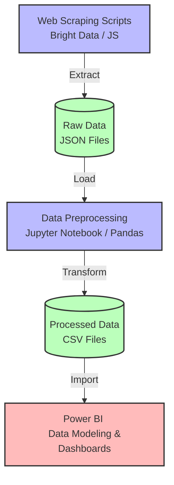

# T20 World Cup (Team Selection)

## Problem Statement

The agenda is to find the best combination of players possible in order to generate most runs with batsmen as well as have a solid no. of bowlers in order to weaken the opposite team.

## Objective

- The team should be able to score at least 180 runs on an average
- They should be to defend 150 runs on an average

<i>“WE DON’T KNOW THE STRENGTHS AND WEAKNESSES OF OUR OPPONENTS BUT GIVE ME THE BEST 11 FROM THE GIVEN DATA”</i>

## Architecture

## Tech Stack

* **Web Scraping:** Bright Data (JavaScript)
* **Data Preprocessing:** Python(Pandas)
* **Data Visualization & Modeling:** Microsoft Power BI